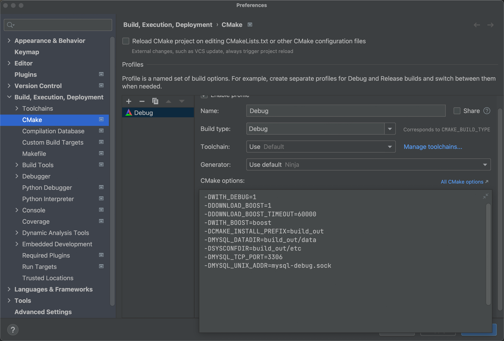
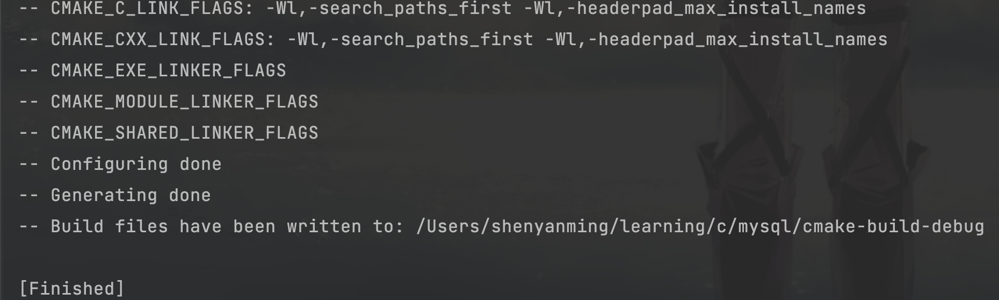
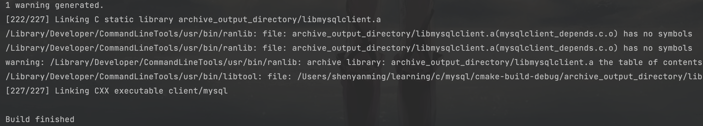
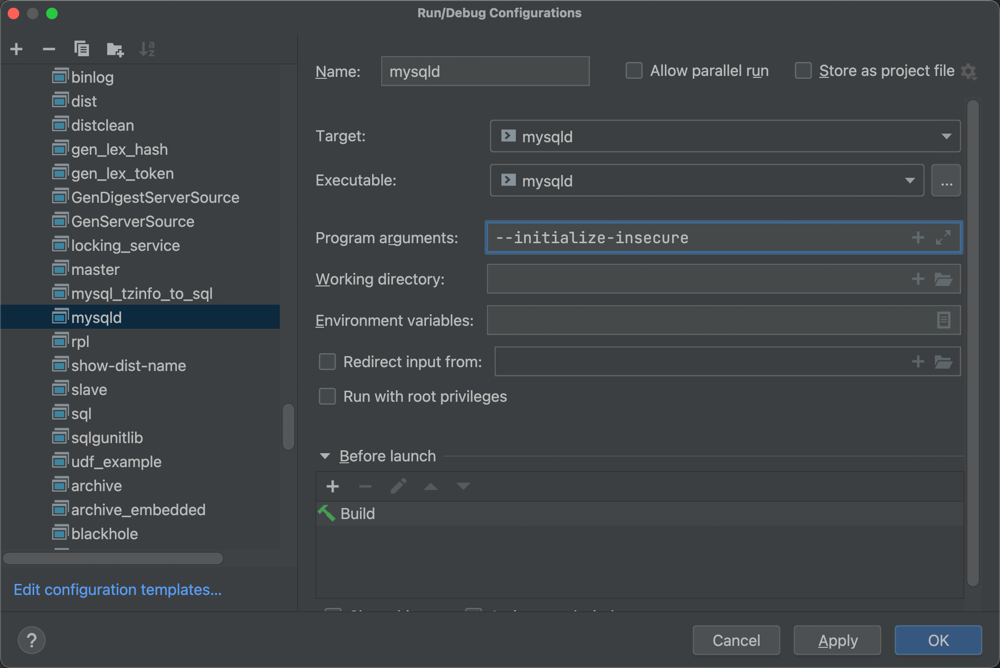

# MySQL 5.7 源码编译调试


# 1.环境配置

操作系统: macOS Monterry

IDE：Clion（ 2022.03）

# 2.环境搭建

直接在`github`下载MySQL 的源码：https://github.com/mysql/mysql-serve，它是用 CMake 构建的，需要本机提前安装 CMake。

## 2.1 配置构建参数

 在 Clion 中配置构建参数:



```bash
-DWITH_DEBUG=1
-DDOWNLOAD_BOOST=1
-DDOWNLOAD_BOOST_TIMEOUT=60000
-DWITH_BOOST=boost
-DCMAKE_INSTALL_PREFIX=build_out
-DMYSQL_DATADIR=build_out/data
-DSYSCONFDIR=build_out/etc
-DMYSQL_TCP_PORT=3306
-DMYSQL_UNIX_ADDR=mysql-debug.sock
```

各个参数的含义：

- -DWITH_DEBUG=1，开启DEBUG模式
- -DDOWNLOAD_BOOST=1，boost不存在时自动下载
- -DDOWNLOAD_BOOST_TIMEOUT=60000，下载boost的超时时间
- -DWITH_BOOST=boost，boost目录，不存在时会自动下载到该目录
- -DCMAKE_INSTALL_PREFIX=build_out，MySQL安装目录
- -DMYSQL_DATADIR=build_out/data，MySQL数据目录
- -DSYSCONFDIR=build_out/etc，`my.cnf`配置文件默认目录
- -DMYSQL_TCP_PORT=3306，指定 MySQL启动端口号（可选）
- -DMYSQL_UNIX_ADDR=mysql-debug.sock，默认/tmp/mysql.sock，避免冲突（可选）
- `所有可选参数：https://dev.mysql.com/doc/refman/5.7/en/source-configuration-options.html`

等待 Clion 构建，完成后可以在 CMake 窗口看到以下信息：



因为clion默认的构建目录名为：`cmake-build-debug`，所以使用下面命令手动创建目录：

```bash
mkdir -p cmake-build-debug/build_out cmake-build-debug/build_out/data cmake-build-debug/build_out/etc
```

## 2.2 编译

之前构建的时候指定配置文件为：`-DSYSCONFDIR=build_out/etc`，所以在指定目录下创建一个`my.cnf`文件，加入以下条件：

```cobol
[mysqld]
innodb_file_per_table = 1
```

设置 innodb_file_per_table=1 后，InnoDB 存储引擎将为每个表创建一个单独的数据文件，当然有其它 MySQL 配置参数都可以写在里面。后面就可以开始启动编译了，如果使用clion，就是点击`锤子按钮`🔨，等待编译结束：



## 2.3 初始MySQL

上述逻辑执行完，就可以启动 MySQL，不过需要一个初始化的用户/密码，所以在clion运行命令选择`mysqld`，加入配置：`--initialize-insecure`



运行后MySQL 会自动创建一个账户为：`root`，密码为空。然后把`myqsld`命令的参数清空，改用`debug`模式就可以开始愉快地调试源码了，随便找一个客户端使用下面的连接信息：

- 主机：127.0.0.1
- 端口：3306
- 用户名：roor
- 密码：
